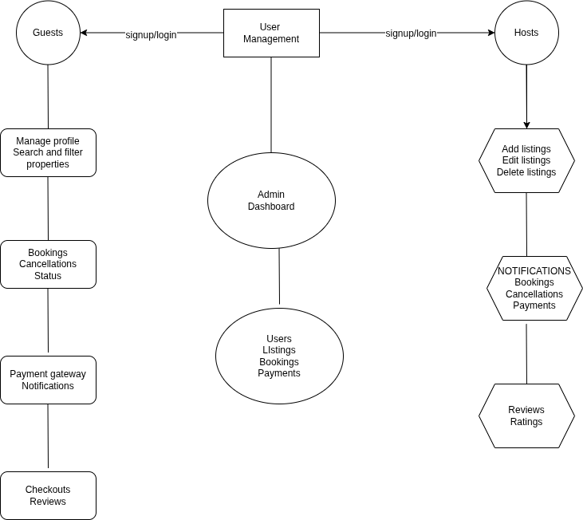

# Airbnb Clone Backend Core

This repository contains the backend implementation for an Airbnb clone application. The system provides comprehensive functionality for property rentals, user management, and booking operations.

## System Architecture

The backend is built using a modular architecture with the following core components:

## Core Features

### 1. User Management

The user management system handles authentication, authorization, and profile management:

- **Registration**: Secure signup process for both guests and hosts
- **Authentication**: JWT-based authentication with OAuth integration
- **Profile Management**: Comprehensive user profile handling

### 2. Property Listings Management

Complete property lifecycle management for hosts:

- **Listing Creation**: Detailed property information input
- **Listing Management**: Edit and removal capabilities

### 3. Search and Filtering

Robust property discovery system:

- **Advanced Search**: Location, price, capacity, and amenity-based filtering
- **Results Optimization**: Pagination for efficient data delivery

### 4. Booking Management

End-to-end booking process handling:

- **Booking Creation**: Date validation and availability checks
- **Booking Lifecycle**: Status tracking from creation to completion
- **Cancellation Handling**: Policy-based cancellation processing

### 5. Payment Integration

Secure financial transaction processing:

- **Payment Gateways**: Integration with industry-standard payment providers
- **Multi-currency Support**: International payment capabilities
- **Automated Payouts**: Host compensation management

### 6. Reviews and Ratings

Trust and quality assurance system:

- **User Feedback**: Guest reviews and ratings for properties
- **Host Responses**: Communication channel for hosts
- **Verification**: Booking-linked reviews to maintain integrity

### 7. Notifications System

Communication infrastructure:

- **Multi-channel Alerts**: Email and in-app notifications
- **Event Triggers**: Automated notifications for key system events

### 8. Admin Dashboard

System management interface:

- **Oversight Tools**: Monitoring and management of core entities
- **Administrative Controls**: User, listing, and transaction management